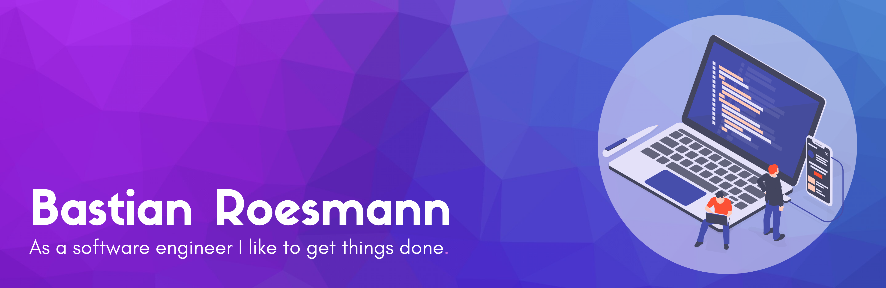

# Hi, I'm Bastian 👋 👨🏻‍💻

I'm a software engineer who is passionate about driving the digital transformation,
creating convincing solutions and building solid, sustainable software.
Some technologies I enjoy working with include PHP, Go and Amazon Web Services. 
I recently started to explore Flutter and Dart for app development.

I spend most of my time working on closed-source projects as a freelancer. Nevertheless, I
try to get deeper into open-source projects from time to time. You can explore
some results of this effort on my Github profile.

# Toolbox for the magic ⚡
I have experience with the following tech-stack. Comprehensibly my knowledge is not top-notch
and up-to-date in every topic:

Atlassian · Amazon Web Services · Bootstrap · C# · CSS · Dart · DigitalOcean · Docker · ExtJS
· Flutter · Git · Go · GoLand · GraphQL · headless CMS · HTTP · HTML · JavaScript · jQuery · Linux ·
macOS · MSBuild · MS SQL Server · MySQL · PHP · PhpStorm · Powershell · React · Redux · REST ·
serverless · SEO · SVN · Swift · TypeScript · Uberspace · VirtualBox · VMware Workstation ·
Windows · Xcode

# Find me around the web 🌍
I like sharing updates on [Twitter][twitter]. If you are interested in some opinionated
insights about tech-stuff, a digital lifestyle and earning money with it you
can visit my [digitalPush][website] website.

[website]: https://www.digitalpush.net
[twitter]: https://twitter.com/bastianroesmann